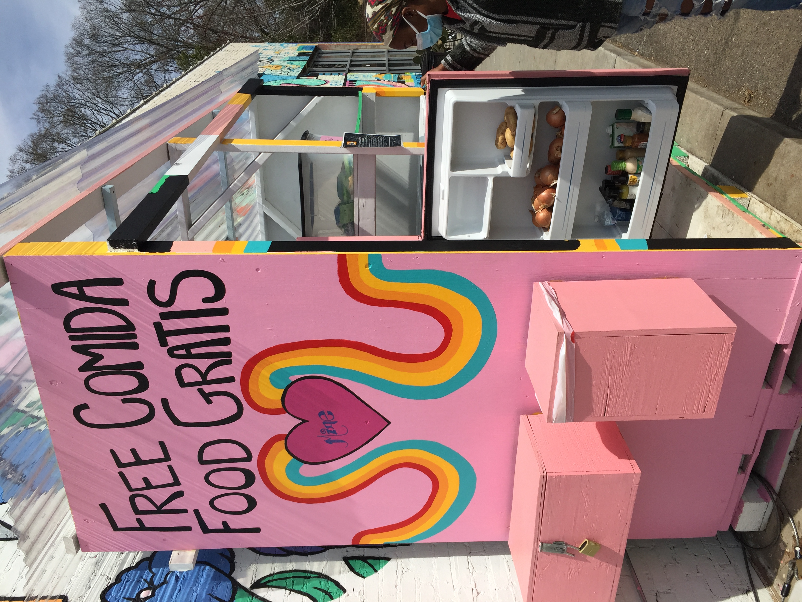
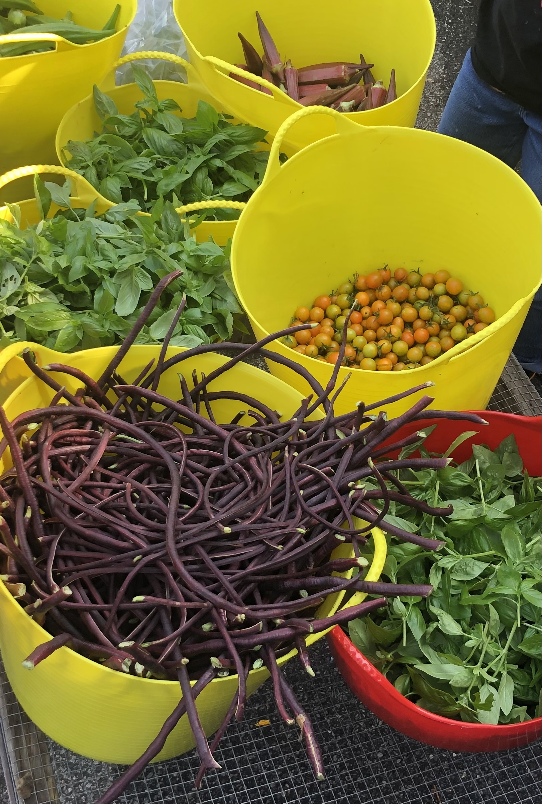
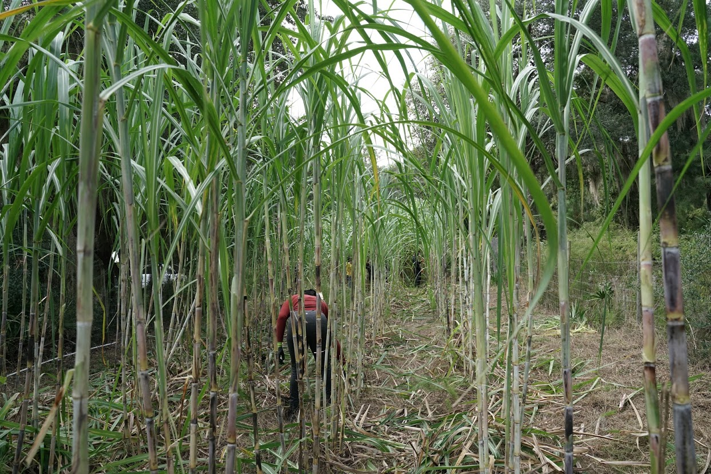
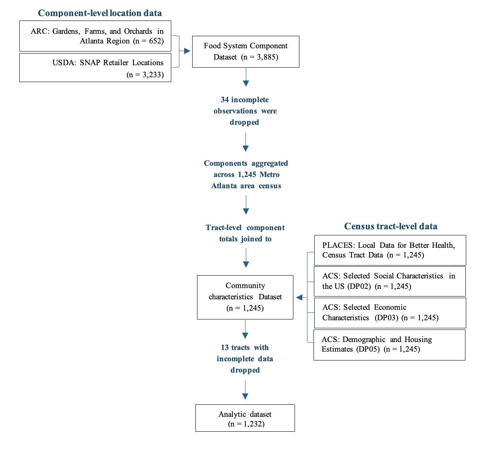
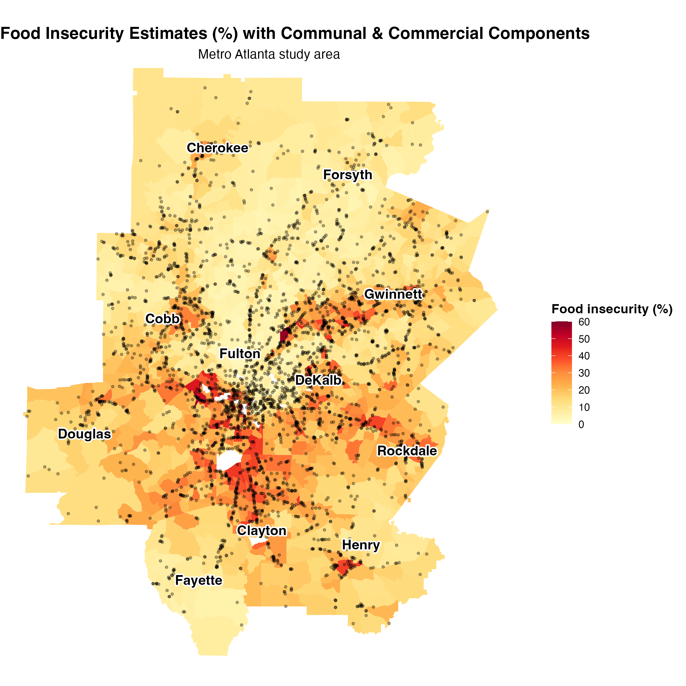
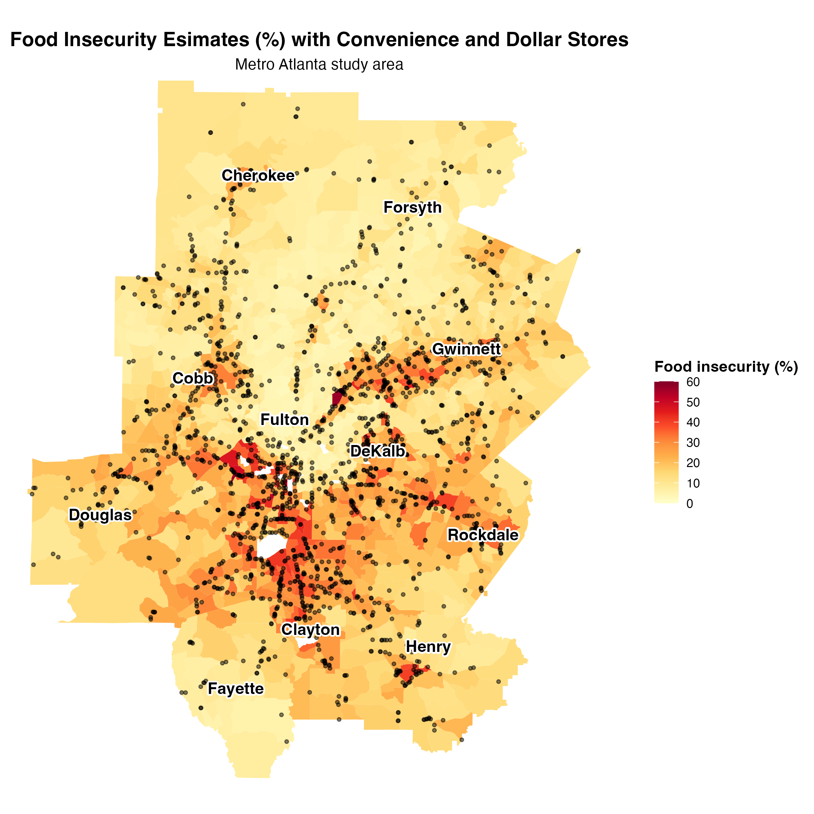
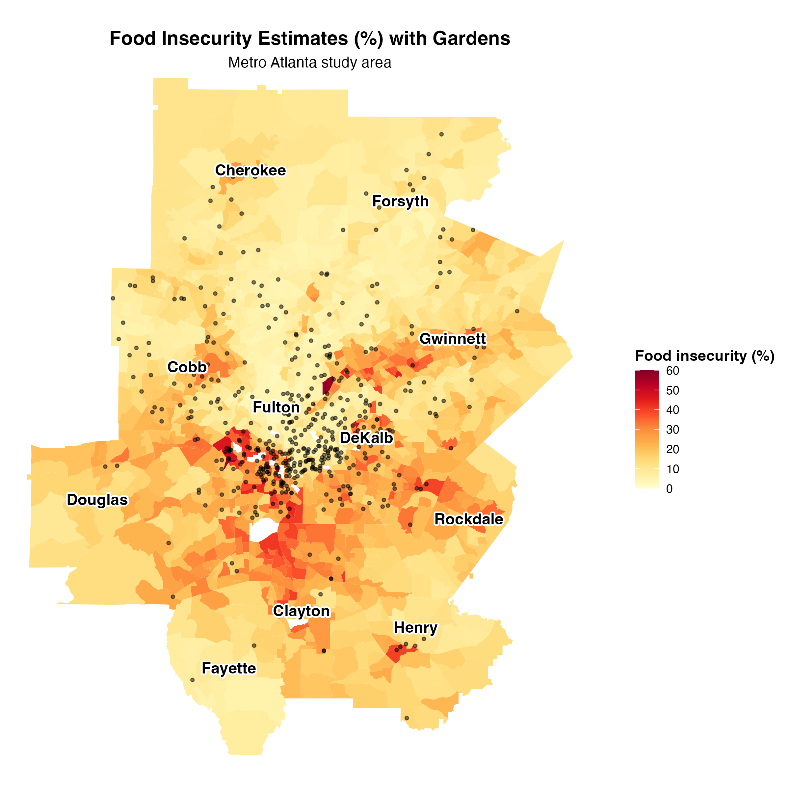

```{r setup, include=FALSE}
knitr::opts_chunk$set(echo = FALSE, warning=FALSE, message=FALSE)
library(flexdashboard)
library(leaflet)
library(dplyr)
library(sf)
library(here)
library(htmlwidgets)
library(here)
library(DT)
library(readxl)
library(kableExtra)
library(knitr)
```

```{r load data}
here::i_am("index.Rmd")

clean_pts <- readRDS(here("objects/clean_pts.rds")) |>
  st_transform(4326) |>
  mutate(
    subtype_recode = case_when(
      subtype_recode %in% c("Supermarket", "Super Store", "Grocery Store") ~ "Grocery Stores",
      subtype_recode == "dollar_store" ~ "Dollar Stores",
      subtype_recode == "pharmacy" ~ "Pharmacies",
      subtype_recode == "Farmers Markets" ~ "Farmers' Markets",
      subtype_recode == "Convenience Store" ~ "Convenience Stores",
      subtype_recode == "Specialty Store" ~ "Specialty Stores",
      TRUE ~ subtype_recode
    )
  )

commercial_types <- c("Grocery Stores", "Convenience Stores", "Dollar Stores", "Pharmacies", "Specialty Stores")

communal_types <- c("Gardens", "Farms", "Orchards", "Farmers' Markets")
```

Background
================================================================================

Column {data-width=400}
-----------------------------------------------------------------

###

<p style="font-size: 48px;">
**Community Assets Rooted in Place**
</p>

<p style="font-size: 32px;">
Associations Between Local Food Systems and Food Insecurity in Metro Atlanta
<br>
<br>
<br>
<br>
<br>
<br>
<p style="text-align: right; margin-top: 20px; font-size: 32px;">
**Sofia Charlot, MPH**
</p>

<p style="text-align: right; font-size: 20px;">
Behavioral, Social, & Health Education Sciences
<br>
Data Science Certificate
</p>


Column {data-width=400}
-----------------------------------------------------------------

###

<div style="text-align: center; height: auto;">
  
  
  
  
  
</div>

  Column {data-width=200}
-----------------------------------------------------------------
  
###
  
<br>
<br>
<br>
<br>
<br>
<br>
<p style="font-size: 22px; margin-top: 20px; font-style: italic; font-weight: bold;">
  "Food security exists when all people, at all times, have physical and economic access to sufficient, safe and nutritious food to meet their dietary needs and food preferences for an active and healthy life"
</p>
  
<p style="font-size: 22px; margin-top: 10px;">
  -FAO, 1996
</p>

Local Food System Components 
===============================================================================

Column {.tabset}
-------------------------------------

### Local Food System Components

<p style="font-size: 32px; text-align: center;">
  <strong>Local Food System Components in Metro Atlanta</strong>
</p>

<div style="border: 1px solid #ccc; padding: 12px; border-radius: 6px; margin-bottom: 15px; text-align: left;">
  <p style="font-size: 16px;">
    <strong>Local food systems</strong> are interconnected components that support the production, distribution, and consumption of food. <strong>Local food systems shape food access</strong> through mechanism like availability, accessibility, and affordability. They include:
  </p>

  - <strong>Communal components:</strong> gardens, farms, orchards, and farmers’ markets
  
  - <strong>Commercial components:</strong> grocery stores, convenience stores, dollar stores, specialty stores, and pharmacies)
  
  <strong>Use the next two tabs to explore the local food system components included in this study.</strong>
</div>


### Explore Commercial Components

<strong>Commercial Components in Metro Atlanta</strong>
```{r commercial points}
pal <- colorFactor(
  palette = c("orange", "blue", "darkgreen", "purple",  "red", "darkslategrey"),
  domain = clean_pts$subtype_recode
)

tract_sf <- readRDS(here("objects/tract_sf.rds")) |>
  st_transform(4326)

#Get county boundaries

county_sf <- st_read(here("tl_2020_13_all/tl_2020_13_county20.shp"), quiet = TRUE)|>
  st_transform(4326) |>
  filter(NAME20 %in% c(
    "Cherokee", "Clayton", "Cobb", "DeKalb", "Douglas",
    "Fayette", "Forsyth", "Fulton", "Gwinnett",
    "Henry", "Rockdale"
  ))

county_labels <- county_sf |>
  st_point_on_surface()

subtype_recode_list <- commercial_types[commercial_types %in% unique(clean_pts$subtype_recode)]

m <- leaflet(options = leafletOptions(
    minZoom = 8,
    maxBounds = list(
      c(33.23, -84.95),   # southwest: lat, lng
      c(34.40, -83.72)    # northeast: lat, lng
    )
  )
) |>
  addProviderTiles(providers$CartoDB.Positron) |>
  fitBounds(
    lng1 = -84.95, lat1 = 33.25,   # southwest corner
    lng2 = -83.72, lat2 = 34.40    # northeast corner
  ) |>
  addControl(
    html = htmltools::HTML(
      "<div style='background: rgba(255,255,255,0.9);
                  padding: 6px 8px;
                  border: 1px solid #999;
                  border-radius: 4px;
                  text-align: center;
                  line-height: 1.1;'>
         <div style='font-size: 18px;'>▲</div>
         <div style='font-size: 12px; font-weight: bold;'>N</div>
       </div>"
    ),
    position = "topleft"
  ) |>
    addPolygons(
    data = county_sf,
    weight = 1.25,
    color = "black",
    fill = FALSE,
    opacity = 0.5,
    group = "Counties"
  ) |>
  addLabelOnlyMarkers(
    data = county_labels,
    label = ~NAME20,
    group = "County labels",
    labelOptions = labelOptions(
      noHide = TRUE,
      direction = "center",
      textOnly = TRUE,
      style = list(
        "font-weight" = "bold",
        "font-size" = "14px"
      )
    )
  ) |>
  addCircleMarkers(
    data = clean_pts |>
      dplyr::filter(subtype_recode %in% commercial_types),
    radius = 2.3,
    stroke = FALSE,
    fillOpacity = 0.7,
    color = ~pal(subtype_recode),
    fillColor = ~pal(subtype_recode),
    label = ~lapply(
    paste0(
      "<strong>Component Name:</strong> ", Name, "<br/>"
      ),
    htmltools::HTML
    ),
    labelOptions = labelOptions(
      direction = "auto",
      style = list(
        "font-weight" = "bold",
        "font-size" = "12px",
        "padding" = "6px 8px"
    )
  ),
  group = "All"
  ) |>
  htmlwidgets::onRender("
  function(el, x) {
    var map = this;

    function resizeMarkers() {
      var z = map.getZoom();
      var r;

      if (z <= 8) {
        r = 2.3;
      } else if (z == 9) {
        r = 3.2;
      } else if (z == 10) {
        r = 4.2;
      } else if (z == 11) {
        r = 5.2;
      } else {
        r = 6.2;
      }

      map.eachLayer(function(layer) {
        if (layer instanceof L.CircleMarker) {
          layer.setRadius(r);
        }
      });
    }

    resizeMarkers();
    map.on('zoomend', resizeMarkers);
  }
")

for (t in subtype_recode_list) {
  m <- m |>
    addCircleMarkers(
      data = clean_pts |>
        dplyr::filter(subtype_recode == t),
      radius = 2.3,
      stroke = FALSE,
      fillOpacity = 0.7,
      color = ~pal(subtype_recode),
      fillColor = ~pal(subtype_recode),
      label = ~lapply(
        paste0(
          "<strong>Component Name:</strong> ", Name, "<br/>"
          ),
        htmltools::HTML
      ),
      labelOptions = labelOptions(
        direction = "auto",
        style = list(
          "font-weight" = "bold",
          "font-size" = "12px",
          "padding" = "6px 8px"
        )
      ),
      group = as.character(t)
    )
}

legend_labels <- commercial_types[commercial_types %in% unique(clean_pts$subtype_recode)]

  m |>
    addLegend(
      position = "bottomleft",
      colors = pal(legend_labels),
      labels = legend_labels,
      title = "Commerical component type",
      opacity = 1
    ) |>
    addLayersControl(
      baseGroups = c("All", subtype_recode_list),
      options = layersControlOptions(collapsed = FALSE)
    )

```

### Explore Communal Components

<strong>Communal Components in Metro Atlanta</strong>
```{r communal points}
pal <- colorFactor(
  palette = c("orange", "blue", "darkgreen", "purple",  "red", "darkslategrey"),
  domain = clean_pts$subtype_recode
)

tract_sf <- readRDS(here("objects/tract_sf.rds")) |>
  st_transform(4326)

#Get county boundaries

county_sf <- st_read(here("tl_2020_13_all/tl_2020_13_county20.shp"), quiet = TRUE)|>
  st_transform(4326) |>
  filter(NAME20 %in% c(
    "Cherokee", "Clayton", "Cobb", "DeKalb", "Douglas",
    "Fayette", "Forsyth", "Fulton", "Gwinnett",
    "Henry", "Rockdale"
  ))

county_labels <- county_sf |>
  st_point_on_surface()

subtype_recode_list <- communal_types[communal_types %in% unique(clean_pts$subtype_recode)]


m <- leaflet(options = leafletOptions(
    minZoom = 8,
    maxBounds = list(
      c(33.23, -84.95),   # southwest: lat, lng
      c(34.40, -83.72)    # northeast: lat, lng
    )
  )
) |>
  addProviderTiles(providers$CartoDB.Positron) |>
  fitBounds(
    lng1 = -84.95, lat1 = 33.25,   # southwest corner
    lng2 = -83.72, lat2 = 34.40    # northeast corner
  ) |>
  addControl(
    html = htmltools::HTML(
      "<div style='background: rgba(255,255,255,0.9);
                  padding: 6px 8px;
                  border: 1px solid #999;
                  border-radius: 4px;
                  text-align: center;
                  line-height: 1.1;'>
         <div style='font-size: 18px;'>▲</div>
         <div style='font-size: 12px; font-weight: bold;'>N</div>
       </div>"
    ),
    position = "topleft"
  ) |>
    addPolygons(
    data = county_sf,
    weight = 1.25,
    color = "black",
    fill = FALSE,
    opacity = 0.5,
    group = "Counties"
  ) |>
  addLabelOnlyMarkers(
    data = county_labels,
    label = ~NAME20,
    group = "County labels",
    labelOptions = labelOptions(
      noHide = TRUE,
      direction = "center",
      textOnly = TRUE,
      style = list(
        "font-weight" = "bold",
        "font-size" = "14px"
      )
    )
  ) |>
  addCircleMarkers(
    data = clean_pts |>
      dplyr::filter(subtype_recode %in% communal_types),
    radius = 2.3,
    stroke = FALSE,
    fillOpacity = 0.7,
    color = ~pal(subtype_recode),
    fillColor = ~pal(subtype_recode),
    label = ~lapply(
    paste0(
      "<strong>Component Name:</strong> ", Name, "<br/>"
      ),
    htmltools::HTML
    ),
    labelOptions = labelOptions(
      direction = "auto",
      style = list(
        "font-weight" = "bold",
        "font-size" = "12px",
        "padding" = "6px 8px"
    )
  ),
  group = "All"
  ) |>
  htmlwidgets::onRender("
  function(el, x) {
    var map = this;

    function resizeMarkers() {
      var z = map.getZoom();
      var r;

      if (z <= 8) {
        r = 2.3;
      } else if (z == 9) {
        r = 3.2;
      } else if (z == 10) {
        r = 4.2;
      } else if (z == 11) {
        r = 5.2;
      } else {
        r = 6.2;
      }

      map.eachLayer(function(layer) {
        if (layer instanceof L.CircleMarker) {
          layer.setRadius(r);
        }
      });
    }

    resizeMarkers();
    map.on('zoomend', resizeMarkers);
  }
")

for (t in subtype_recode_list) {
  m <- m |>
    addCircleMarkers(
      data = clean_pts |> filter(subtype_recode == t),
      radius = 2.3,
      stroke = FALSE,
      fillOpacity = 0.7,
      color = ~pal(subtype_recode),
      fillColor = ~pal(subtype_recode),
      label = ~lapply(
        paste0(
          "<strong>Component Name:</strong> ", Name, "<br/>"
          ),
        htmltools::HTML
      ),
      labelOptions = labelOptions(
        direction = "auto",
        style = list(
          "font-weight" = "bold",
          "font-size" = "12px",
          "padding" = "6px 8px"
        )
      ),
      group = as.character(t)
    )
}

legend_labels <- communal_types[communal_types %in% unique(clean_pts$subtype_recode)]

  m |>
    addLegend(
      position = "bottomleft",
      colors = pal(legend_labels),
      labels = legend_labels,
      title = "Communal component type",
      opacity = 1
    ) |>
    addLayersControl(
      baseGroups = c("All", subtype_recode_list),
      options = layersControlOptions(collapsed = FALSE)
    )
```

Food Insecurity Prevalence
================================================================================

<p style="font-size: 32px; text-align: center;">
  <strong>Local food systems are upstream determinants of food security</strong>
</p>

Column {data-width=250}
--------------------------------------------------------

###

**Food Insecurity in Georgia**

- 14.3% across the state

- 12.0% across Metro Atlanta


**Food Insecurity in the Unites States**

- 13.7% of households nationally

- 18.4% of households with children

- 36.8% of households headed by single-mothers with children

- 39.4% of households with low income


**Food Insecurity is Disperate**

- 23.3% of Native American and Alaska Native households

- 21.0% of Black households

- 16.9% of Latinx households

- 8.0% of White households

- 5.4% of Asian households 


**Food Insecurity is Associated with Negative Outcomes** 

- Chronic disease (e.g., hypertension, heart disease, and kidney disease)

- poor health in children

- Anxiety and depression


Column {data-width=750}
--------------------------------------------------------

### Use this map to explore food insecurity prevalence in Metro Atlanta

```{r}
library(leaflet)
library(dplyr)
library(sf)
library(here)
library(readr)

here::i_am("index.Rmd")

# tract polygons with geometry
tract_sf <- readRDS(here("objects/tract_sf.rds")) |>
  st_transform(4326)

# food insecurity table with GEOID + food_insecurity
fi_df <- readRDS(here("objects/tract_master_df.rds")) |>
  mutate(GEOID = as.character(GEOID))

# join fi data onto tract geometry
tract_map_sf <- tract_sf |>
  mutate(GEOID = as.character(GEOID)) |>
  left_join(fi_df, by = "GEOID") |>
  mutate(
    food_insecurity_pct = if_else(food_insecurity <= 1, food_insecurity * 100, food_insecurity),
    fi_popup = paste0(round(food_insecurity_pct, 1), "%"),
    pop_popup = format(adults.x, big.mark = ",", scientific = FALSE, trim = TRUE)
  )

county_sf <- st_read(here("tl_2020_13_all/tl_2020_13_county20.shp"), quiet = TRUE) |>
  st_transform(4326) |>
  filter(NAME20 %in% c(
    "Cherokee", "Clayton", "Cobb", "DeKalb", "Douglas",
    "Fayette", "Forsyth", "Fulton", "Gwinnett",
    "Henry", "Rockdale"
  ))

county_labels <- county_sf |>
  st_point_on_surface()

pal <- colorNumeric(
  palette = "YlOrRd",
  domain = tract_map_sf$food_insecurity_pct,
  na.color = "transparent"
)

max_fi <- max(tract_map_sf$food_insecurity_pct, na.rm = TRUE)
legend_top <- ceiling(max_fi / 5.0) * 5.0
legend_breaks <- seq(0.0, legend_top, by = 5.0)

choro_map <- leaflet(
  data = tract_map_sf,
  options = leafletOptions(
    minZoom = 8,
    maxBounds = list(
      c(33.20, -85.05),
      c(34.45, -83.65)
    )
  )
) |>
  addProviderTiles(providers$CartoDB.PositronNoLabels) |>
  fitBounds(
    lng1 = -84.95, lat1 = 33.25,
    lng2 = -83.72, lat2 = 34.40
  ) |>
    addControl(
    html = htmltools::HTML(
      "<div style='background: rgba(255,255,255,0.9);
                  padding: 6px 8px;
                  border: 1px solid #999;
                  border-radius: 4px;
                  text-align: center;
                  line-height: 1.1;'>
         <div style='font-size: 18px;'>▲</div>
         <div style='font-size: 12px; font-weight: bold;'>N</div>
       </div>"
    ),
    position = "topleft"
  ) |>
  addPolygons(
    fillColor = ~pal(food_insecurity_pct),
    fillOpacity = 0.75,
    color = "white",
    weight = 0.3,
    opacity = 0.6,
    smoothFactor = 0.2,
    label = ~lapply(
      paste0(
        "<strong>Food insecurity prevalence:</strong> ", fi_popup, "<br/>",
        "<strong>Adult Population:</strong> ", pop_popup, " persons"
      ),
      htmltools::HTML
    ),
    labelOptions = labelOptions(
      direction = "auto",
      style = list(
        "font-weight" = "bold",
        "font-size" = "12px",
        "padding" = "6px 8px"
      )
  ),
    group = "Food insecurity"
  ) |>
  addPolylines(
    data = tract_map_sf,
    color = "black",
    weight = 0.3,
    opacity = 0.5,
    group = "Tract boundaries"
  ) |>
  addPolylines(
    data = county_sf,
    color = "black",
    weight = 1.25,
    opacity = 0.9,
    group = "County boundaries"
  ) |>
  addLabelOnlyMarkers(
    data = county_labels,
    label = ~NAME20,
    group = "County labels",
    labelOptions = labelOptions(
      noHide = TRUE,
      direction = "center",
      textOnly = TRUE,
      style = list(
        "font-weight" = "bold",
        "font-size" = "11px"
      )
    )
  ) |>
  addLegend(
  position = "bottomright",
  pal = pal,
  values = ~food_insecurity_pct,
  bins = legend_breaks,
  title = paste0(
    "Food insecurity (%)"),
  opacity = 1,
  className = "small-legend"
) |>
  addLayersControl(
    overlayGroups = c("Tract boundaries", "County boundaries", "County labels"),
    options = layersControlOptions(collapsed = FALSE)
  )
htmltools::tagList(
  htmltools::tags$style(htmltools::HTML("
    .small-legend {
      font-size: 10px !important;
      line-height: 12px !important;
      padding: 4px 6px !important;
    }
    .small-legend i {
      width: 10px !important;
      height: 10px !important;
    }
    .small-legend .legend-title {
      font-size: 11px !important;
      font-weight: bold;
      margin-bottom: 4px !important;
    }
  ")),
  htmltools::tags$div(
    "Food Insecurity Prevalence (%) and Adult Population by Census Tract within the Metro Atlanta Area",
    style = "font-size: 18px; font-weight: bold; margin-bottom: 8px;"
  ),
  choro_map
)
```


Study Details
================================================================================

Column {.tabset}
-----------------------------------------------------------------

### Study Aims

<div style="border: 1px solid #ccc; padding: 12px; border-radius: 6px; margin-bottom: 15px; text-align: left;">
  <p style="font-size: 32px;">
    <strong>Purpose Statement</strong>
  </p>
  <p style="font-size: 16px;">
    The purpose of this study is to examine the associations between local food insecurity rates and the relative concentration of different communal and commercial local food system components in neighborhoods across the Metro Atlanta area (Cherokee, Clayton, Cobb, DeKalb, Douglas, Fayette, Forsyth, Fulton, Gwinnett, Henry, and Rockdale County).
  </p>
</div>

<div style="border: 1px solid #ccc; padding: 12px; border-radius: 6px; margin-bottom: 15px; text-align: left;">
  <p style="font-size: 32px;">
    <strong>Research Questions</strong>
  </p>
  <ol style="font-size: 16px;">
    <li>What is the concentration of communal and commercial local food system components across neighborhoods in the Atlanta Metro area?</li>
    <li>What is the association between the local rates of food insecurity and the concentration of communal and commercial local food system components in neighborhoods across Metro Atlanta?</li>
  </ol>
</div>

### Study Methods

<p style="font-size: 32px; text-align: center;">
  <strong>Statistical Analysis</strong>
</p>

<div style="border: 1px solid #ccc; padding: 12px; border-radius: 6px; margin-bottom: 15px; text-align: left;">
  <p style="font-size: 32px;">
    <strong>Univariate</strong>
  </p>
  <ul style="font-size: 16px;"> 
    <li><strong>Component Counts</strong> (communal and commercial)</li>
    <li><strong>Component Concentrations</strong> (communal and commercial)</li>
    <li><strong>Predictors & Covariates</strong> (Median | Interquartile range | Minimum | Maximum)</li>
  </ul> 
</div>

<div style="border: 1px solid #ccc; padding: 12px; border-radius: 6px; margin-bottom: 15px; text-align: left;">
  <p style="font-size: 32px;">
    <strong>Bivariate</strong>
  </p>
  <ul style="font-size: 16px;"> 
    <li><strong>Simple Linear Regression</strong> (Pearson r | 95% CI | p-value)</li>
  </ul>
</div>

<div style="border: 1px solid #ccc; padding: 12px; border-radius: 6px; margin-bottom: 15px; text-align: left;">
  <p style="font-size: 32px;">
    <strong>Multivariable</strong>
  </p>

  <ul style="font-size: 16px;"> 
    <li>
      <strong>Adjusted linear regression</strong> (Adjusted Beta (β) | 95% CI | p-value)
      <ul style="font-size: 16px;">
        <li><strong>Outcome:</strong> Communal concentration</li>
        <li><strong>Outcome:</strong> Commercial concentration</li>
        <li><strong>Outcome:</strong> Subtype (communal & commercial) concentration</li>
        <li><strong>Main Predictor:</strong> Food insecurity</li>
        <li><strong>Model Covariates:</strong> Median household income | Limited educational attainment | % Black residents | % Asian residents | % Multiracial residents</li>
      </ul>
    </li>
  </ul>
</div>

### Study Measures

<p style="font-size: 32px; text-align: center;">
  <strong>Outcomes, Predictors, and Covariates</strong>
</p>


```{r}
here::i_am("index.Rmd")

table1_df <- readRDS("raw_data/table1_df.rds")

#Univariate data table
knitr::kable(
   table1_df,
   caption = "**Distribution of Communal and Commercial Components**",
   digits = 2
 )


```

```{r}
here::i_am("index.Rmd")

table2_df <- readRDS("raw_data/table2_df.rds")


#Univariate data table
knitr::kable(
  table2_df,
  caption = "**Distribution of Study Covariates**",
  digits = 2
)

```

### Dataset Description

<p style="font-size: 32px; text-align: center;">
<strong>Constructing the Analytic Sample</strong>
</p>

<div style="border: 1px solid #ccc; padding: 12px; border-radius: 6px; margin-bottom: 15px; text-align: left;">
  <p style="font-size: 16px; text-align: left;">
  Study outcomes were constructed within the analytic dataset using component data from Atlanta Regional Commission's (ARC) [<strong>Gardens, Farms, and Orchards in Atlanta Region</strong>](https://opendata.atlantaregional.com/datasets/GARC::gardens-farms-and-orchards-in-atlanta-region-public-view-layer/about) dataset last updated in 2025 and the U.S. Department of Agriculture's [<strong>SNAP Retailer</strong>](https://www.fns.usda.gov/snap/retailer-locator/data) dataset from 2024.
  </p>
  
  <p style="font-size: 16px; text-align: left;">
  Resource indicator data (food insecurity, SNAP participation, transportation barriers, and housing insecurity) came from the Center for Disease Control’s (CDC) [<strong>Population Level Analysis and Community EStimates (PLACES): Local Data for Better Health</strong>](https://catalog.data.gov/dataset/places-census-tract-data-gis-friendly-format-2024-release) dataset released in 2024.
  </p>
  
  <p style="font-size: 16px; text-align: left;">
  Other study covariates (socioeconomic measures, racial/ethnic composition, and population totals) were 5-year estimates (2019 to 2023) from the <strong>American Community Survey (ACS)</strong> [<strong>DP03</strong>](https://data.census.gov/table/ACSDP5Y2023.DP03?q=DP03), [<strong>DP02</strong>](https://data.census.gov/table/ACSDP5Y2023.DP02), and [<strong>DP05</strong>](https://data.census.gov/table/ACSDP5Y2023.DP05).
  </p>
  
  <p style="font-size: 16px; text-align: left;">
  The analytic dataset was compiled between October 2025 and December 2025. Analysis was completed at the census-tract level for the 1,232 tracts included in the study.
  </p>
</div>  

<strong>Stepwise Process Used to Build the Analytic Dataset</strong>

<div style="text-align: center; height: auto;">
  
</div>


Study Findings
================================================================================

Column {.tabset}
--------------------------------------------------------------------------------

### Main Finding 1

<div style="border: 1px solid #ccc; padding: 12px; border-radius: 6px; margin-bottom: 15px; text-align: center; font-size: 20px;">
  <strong>What is the concentration of communal and commercial local food system components?</strong>
</div>

<div style="text-align: center; height: auto;">
  
</div>

<div style="border: 1px solid #ccc; padding: 12px; border-radius: 6px; margin-bottom: 15px; text-align: center; font-size: 20px;">
  <strong>Local food insecurity rates were positively associated with higher concentrations of both communal (p = 0.033) and commercial components (p < 0.001)</strong>
</div>

<div style="border: 1px solid #ccc; padding: 12px; border-radius: 6px; margin-bottom: 15px; text-align: left;">
  <ul style="font-size: 16px;">
    <li>Neighborhoods with higher food insecurity rates also had higher concentrations of both communal and commercial food outlets even when controlling for other neighborhood characteristics like household income and racial composition.</li>
    <li>A 10-percentage point increase in food insecurity was associated with 0.40 higher communal concentration per 10,000 adults And 1.49 higher commercial concentration per 10,000 adults.</li>
  </ul>
</div>

### Main Finding 2

<div style="border: 1px solid #ccc; padding: 12px; border-radius: 6px; margin-bottom: 15px; text-align: center; font-size: 20px;">
<strong>What is the association between food insecurity and the concentration of commercial local food system components?</strong>
</div>

<div style="text-align: center; height: auto;">
  
</div>

<div style="border: 1px solid #ccc; padding: 12px; border-radius: 6px; margin-bottom: 15px; text-align: center; font-size: 20px;">
  <strong>The positive association for commercial components was largely driven by convenience stores (p = <0.001) and dollar stores (p = 0.001).</strong>
</div>

<div style="border: 1px solid #ccc; padding: 12px; border-radius: 6px; margin-bottom: 15px; text-align: left;">
  <ul style="font-size: 16px;">
    <li>This aligns with findings from previous studies that suggest that food insecurity is associated with a higher density of convenience and dollar stores.</li>
    <li>This is important because research shows that these outlets sell foods with low nutritional value, and foods that are highly processed, at higher prices.</li>
    <li>So, while technically there may be access to food outlets in areas with higher rates of food insecurity, this doesn’t necessarily translate into access to nutritious foods.</li>
  </ul>
</div>

### Main Finding 3

<div style="border: 1px solid #ccc; padding: 12px; border-radius: 6px; margin-bottom: 15px; text-align: center; font-size: 20px;">
  <strong>What is the association between food insecurity and the concentration of communal local food system components?</strong>
</div>

<div style="text-align: center; height: auto;">
  
</div>

<div style="border: 1px solid #ccc; padding: 12px; border-radius: 6px; margin-bottom: 15px; text-align: center; font-size: 24px;">
  <strong>The positive association between communal components and food insecurity was largely driven by gardens (p = 0.013)</strong>
</div>

<div style="border: 1px solid #ccc; padding: 12px; border-radius: 6px; margin-bottom: 15px; text-align: left;">
  <ul style="font-size: 16px;">
    <li>Each 10 percentage-point increase in food insecurity was associated with a 0.33-unit higher concentration of gardens.</li>
    <li>One interpretation for this pattern is that it reflects strategic and intentional efforts to invest in community assets that can change the local food systems and create better food access.</li>
    <li>On a national scale, U.S. states and local governments have increasingly supported urban agriculture and community gardens through land-access policies, grants, tax incentives, and other programs.</li>
    <li>About a decade ago, like in many other cities, local food system leaders in the Metro started making plans towards addressing food access through expanding urban agriculture.</li>
  </ul>
</div>

Study Conclusions
================================================================================

<p style="font-size: 32px; text-align: center;">
  <strong>Study Conclusions</strong>
</p>

<div style="border: 1px solid #ccc; padding: 12px; border-radius: 6px; margin-bottom: 15px; text-align: left;">
  <p style="font-size: 16px;">
  <strong>There is intentional investments being made in both communal and commercial aspects of the local food system.</strong> Local food system leaders are already finding ways to coordinate those investments so that they are that are mutually beneficial and increase access to food.
  </p>
</div>

<div style="border: 1px solid #ccc; padding: 12px; border-radius: 6px; margin-bottom: 15px; text-align: left;">
  <p style="font-size: 16px;">
  There is movement to address food insecurity through the additions of commercial mechanisms targeted at gaps in food access. <strong>However, these findings suggest that geographic proximity to commercial retailers may not necessarily translate into more food secure populations.</strong>
  </p>
</div>

<div style="border: 1px solid #ccc; padding: 12px; border-radius: 6px; margin-bottom: 15px; text-align: right;">
  <p style="font-size: 16px;">
The positive association between community gardens and food insecurity is likely a product of the use of communal gardens to address gaps in food access. <strong>Just as the physical presence of commercial retailers does not guarantee improved food access, the presence of community gardens alone is unlikely to do so either.</strong> Further collaboration across local food system partners and better alignment between communal and commercial components is how progress continues.
  </p>
</div>

<div style="border: 1px solid #ccc; padding: 12px; border-radius: 6px; margin-bottom: 15px; text-align: left;">
  <p style="font-size: 16px;">
  <strong>Local food systems guided by both socially oriented principles (like justice, equity, and cultural relevance) along with neoliberal tools (technology, information, market mechanisms) can create an interdependence that contributes not only to food access but also to community resilience and local economic vitality.</strong> Because of the growing presence of both communal and commercial food assets, the Metro area is well positioned for deeper integration across these components. Ultimately, achieving this will require intentional efforts grounded in equitable community partnerships and thoughtful city planning.
  </p>
</div>

<div style="border: 1px solid #ccc; padding: 12px; border-radius: 6px; margin-bottom: 15px; text-align: left;">
  <p>
    This dashboard is a contribution towards better alignment across the communal and commercial components of the Metro Atlanta area local food system. It aims to uncover findings that lead to better alignment across components, strategic investments into food outlets, better food security upstream, and better health outcomes downstream.
    <br>
    See the source code within [Sofia's Github repository](https://github.com/S-charlo/thesis_dashboard/tree/main)
  </p>
</div>


